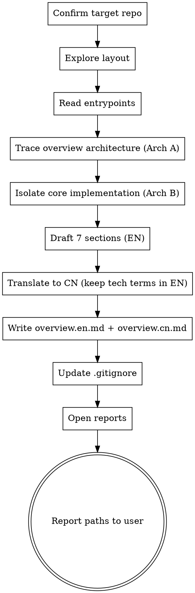
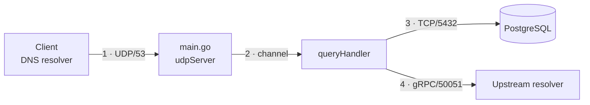
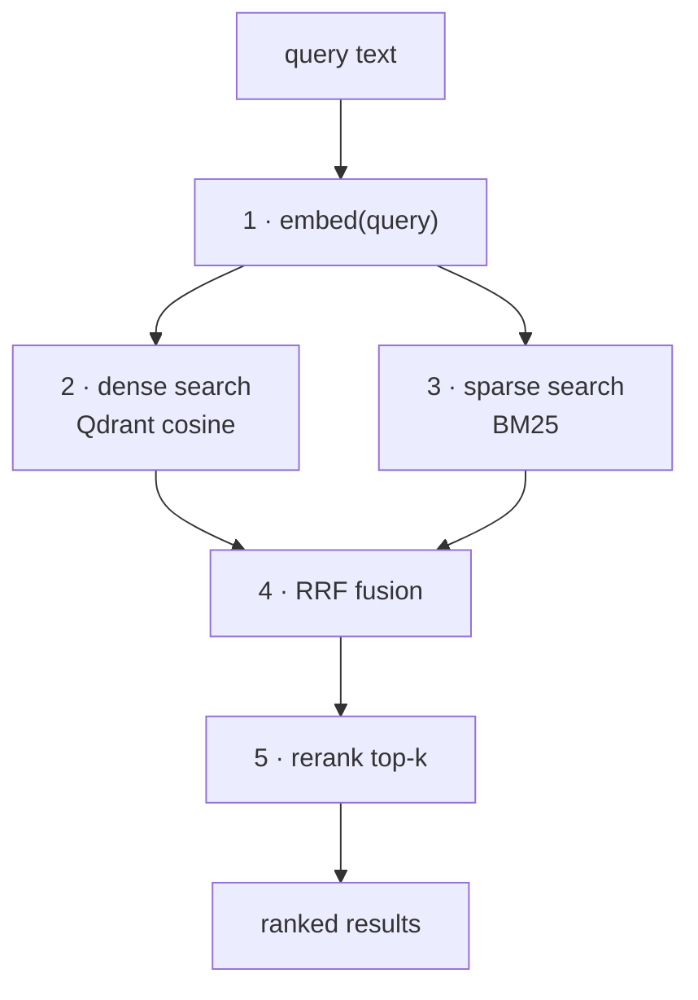

# Exploring a New Project

## Overview

A repeatable protocol for producing a high-quality onboarding report for any unfamiliar repository. Output is written to `.project-exploration/` at the repo root and that folder is added to `.gitignore` so the notes stay local.

**Core principle:** Read before you write. Never fabricate architecture, protocols, or code snippets — every claim must be traceable to a real file in the repo.

**Two hard requirements for every report:**
1. **Bilingual output (双语输出)** — produce BOTH a 中文 (CN) version and an English (EN) version of the report. Keep domain-expertise / technical terms in English inside the Chinese text (see "Bilingual Rules" below).
2. **Two architecture diagrams (两张架构图)** — Section 3 contains **Architecture A (Complete Overview)** and Section 4 contains **Architecture B (Key/Core Implementation)**. Each MUST have a diagram/workflow picture AND detailed point-by-point numbered bullets (1, 2, 3, 4, 5, 6, …).

## When to Use

- First contact with a new repository
- User asks for an overview / walkthrough / onboarding doc
- Preparing to present a codebase to teammates
- Auditing an inherited project

**Do NOT use when:**
- User asks a narrow question about one file (just answer it)
- The exploration output already exists and is current (offer to refresh instead)

## Workflow



## Bilingual Rules (双语规则)

- Produce two files: `overview.en.md` (English) and `overview.cn.md` (中文). They cover the SAME content — the CN file is a faithful translation of the EN file, not a summary.
- **Keep in English inside the CN text** — do NOT translate:
  - Product / tool / framework names: Kubernetes, Gardener, Qdrant, PostgreSQL, Kafka, gRPC, Starlette, MCP, etc.
  - Protocol / transport terms: HTTP/2, TCP, UDP, WebSocket, SSE, RPC
  - Established design-pattern names: worker pool, circuit breaker, CQRS, retry-with-jitter, dependency injection, RRF (Reciprocal Rank Fusion)
  - Code identifiers, file paths, `file:line` references, and code snippets (never translate code or comments-in-code)
  - CLI commands and flags
- Translate to natural 中文: prose, explanations, section headings' descriptive parts, the "why it matters" narrative.
- Diagrams: keep node labels (which are usually identifiers/protocols) in English; a short Chinese caption may be added under the diagram in the CN file.
- If a term has a widely-accepted Chinese rendering AND you translate it, show the English in parentheses on first use, e.g. 微服务 (microservices).

## The 7 Required Sections

Every exploration report MUST contain these sections in this order. (Sections 3 and 4 are the two mandatory architectures.)

### 1. Repository Structure Overview (仓库结构总览)
- A tree of the top 2–3 levels (use `Glob` / `ls`, not guesses)
- One-line purpose per top-level directory
- Call out language(s), build system, package manager, monorepo layout

### 2. Project Motivation (项目动机)
- What real-world problem does it solve?
- Who is the intended user / caller?
- Sources: `README.md`, `CONTRIBUTING.md`, `docs/`, top-level module docstrings, `package.json` / `Cargo.toml` / `go.mod` descriptions
- If motivation is unclear, say so explicitly — do not invent one

### 3. Architecture A — Complete Overview & Implementation (架构一 · 完整总览与实现)

This is the **whole-system** view: every major component, how a request/event flows end-to-end, and where data lands.

- **MUST include a diagram (picture/workflow)** — Mermaid preferred, Graphviz allowed
- **MUST label:** **entrypoint**, **sender/producer**, **receiver/consumer**, data stores, external systems
- **MUST specify protocols and ports** where applicable:
  - Network: TCP 53, UDP 53, HTTP 80, HTTPS 443, gRPC, WebSocket, MQTT, etc.
  - IPC: Unix socket path, named pipe, shared memory, RPC framework
  - Message bus: Kafka topic, NATS subject, RabbitMQ exchange
- **MUST include detailed point-by-point explanation** — numbered bullets 1, 2, 3, 4, 5, 6, … where each number corresponds to a stage/edge in the diagram and walks the reader from entrypoint to persistence.

Example diagram template:


Example point-by-point (numbers map to diagram edges):
1. **Ingress** — client sends a query over UDP/53; `main.go:120` binds the socket.
2. **Dispatch** — the server hands the packet to a `queryHandler` via a buffered channel (`server.go:88`).
3. **Persistence read/write** — handler queries PostgreSQL over TCP/5432 for cached records.
4. **Upstream fallback** — on cache miss, it calls the upstream resolver over gRPC/50051.
5. **Response assembly** — result is encoded and written back to the client socket.
6. **Observability** — each step emits a structured log line / metric.

### 4. Architecture B — Key / Core Implementation (架构二 · 核心实现)

This is the **juicy core** — the single most important mechanism that makes this project what it is (e.g. the RAG retrieval + RRF fusion pipeline, the scheduler loop, the consensus module, the query planner). Zoom IN below the overview.

- **MUST include a focused diagram (picture/workflow)** of just this core mechanism — show the internal steps, not the whole system
- **MUST include detailed point-by-point explanation** — numbered bullets 1, 2, 3, 4, 5, 6, … walking through the core algorithm/data-flow, each pointing to `file:line`
- **MUST reference real code** — tie each numbered step to an actual function/file
- Explain WHY this is the core (what breaks if it's wrong, what makes it clever/non-obvious)

Example focused diagram:


Example point-by-point:
1. **Embed** — `retriever.py:42` turns the query into a dense vector via the embedding model.
2. **Dense retrieval** — cosine search over the Qdrant collection (`retriever.py:61`).
3. **Sparse retrieval** — parallel BM25 lexical search (`retriever.py:75`).
4. **RRF fusion** — Reciprocal Rank Fusion merges both rankings (`fusion.py:18`); this is the clever bit — it needs no score normalization.
5. **Rerank** — top-k candidates re-scored (`retriever.py:96`).
6. **Why core** — if fusion weights are wrong, recall collapses; this module is the project's quality lever.

### 5. Core Technical Implementation (核心技术实现)
- Pick 2–4 pivotal files/functions **beyond** what Arch B already covered (not every file)
- Include **real** code snippets with `file:line` references
- Explain WHY the code is interesting, not just what it does
- Prefer: main loops, protocol handlers, concurrency primitives, state machines, key algorithms
- **Do NOT translate code or in-code comments** in either version

Snippet format:
```go
// server/udp.go:42
func (s *Server) serveUDP(conn *net.UDPConn) {
    for {
        buf := make([]byte, 512)  // classic DNS message size
        n, addr, err := conn.ReadFromUDP(buf)
        ...
    }
}
```

### 6. Reusable Design Concepts (可复用的设计理念)
- Patterns another project could adopt (e.g. bounded worker pool, circuit breaker, plugin registry, CQRS split, retry-with-jitter, feature-flagged rollout)
- For each: name the pattern (keep the pattern name in English), point to the file that implements it, describe portability

### 7. Known Limitations & Potential Improvements (已知局限与潜在改进)
- Look at: `TODO`/`FIXME`/`XXX` comments, open issues in `docs/`, deprecated APIs, missing tests, `known_issues.md`, single points of failure spotted during reading
- Separate **limitations** (things that are) from **improvements** (things that could be)
- Be specific: "no retry on upstream DNS timeout (`resolver.go:88`)" beats "error handling could be better"

## Output Location & Gitignore

**Always write to `<repo-root>/.project-exploration/`.**

Filenames (both required):
- `overview.en.md` — English version
- `overview.cn.md` — 中文版本

(Use `overview.en-<yyyy-mm-dd>.md` / `overview.cn-<yyyy-mm-dd>.md` if refreshing.)

After writing the files, ensure `.gitignore` contains the folder:

```
.project-exploration/
```

Add it if missing. Do not commit the exploration output.

## Execution Checklist

Follow in order. Use `TodoWrite` if the repo is large.

1. **Locate repo root** — `git rev-parse --show-toplevel` (fall back to cwd)
2. **Inventory** — `Glob **/*` limited to reasonable depth; `Read README.md`, top-level manifest files
3. **Find entrypoints** — search for `main`, `__main__`, `cmd/`, `bin/`, `Procfile`, `Dockerfile CMD`, `package.json` scripts
4. **Trace one full request/event path** — from entrypoint to a leaf (DB write, response, log line) → feeds **Arch A**
5. **Identify protocols/ports** — grep for `Listen`, `bind`, `port`, `:8080`, `AddrPort`, `net.Dial`, framework routing tables → feeds **Arch A**
6. **Isolate the core mechanism** — find the single most important algorithm/loop/pipeline → feeds **Arch B**; read its file(s) fully
7. **Draft all 7 sections in English** in a scratch buffer, including both diagrams with numbered point-by-point bullets
8. **Translate to 中文** following the Bilingual Rules (keep tech terms, code, `file:line`, CLI in English)
9. **Create `.project-exploration/` folder**
10. **Write `overview.en.md` AND `overview.cn.md`**
11. **Update `.gitignore`** — append `.project-exploration/` if not already present (idempotent check first)
12. **Open the generated files** — run `open .project-exploration/overview.en.md .project-exploration/overview.cn.md` (macOS) / `xdg-open` (Linux) / `start` (Windows) so the reports surface immediately
13. **Report** both file paths to the user with a one-paragraph bilingual summary

## Quick Reference

| Need | Command |
|------|---------|
| Repo root | `git rev-parse --show-toplevel` |
| Top-level layout | `Glob` with pattern `*` at root |
| Find entrypoints | `Grep` for `func main\|if __name__\|#!/` |
| Find ports | `Grep` for `Listen\|:\d{2,5}\|bind` |
| Find core loop | `Grep` for `for \|while \|def .*pipeline\|async def\|goroutine` |
| Find TODOs | `Grep -n` for `TODO\|FIXME\|XXX\|HACK` |
| Check gitignore | `Read .gitignore` then `Edit` if needed |
| Open the reports | `open` (macOS) / `xdg-open` (Linux) / `start` (Windows) `.project-exploration/overview.en.md .project-exploration/overview.cn.md` |

## Common Mistakes

| Mistake | Fix |
|---------|-----|
| Writing the report before reading code | Read entrypoint + one full flow + the core module first |
| Producing only one language | ALWAYS emit both `overview.en.md` and `overview.cn.md` |
| Translating code / identifiers / `file:line` into Chinese | Keep all code, tech terms, paths, CLI in English |
| Only one architecture diagram | Section 3 (Arch A overview) AND Section 4 (Arch B core) are both required |
| Diagram without numbered walk-through | Every arch needs point-by-point bullets 1,2,3,4,5,6… mapping to the picture |
| Arch B duplicates Arch A | Arch B zooms INTO the single core mechanism, not the whole system |
| Inventing protocol/port from filename | Grep for the actual `Listen*` call |
| Copy-pasting the whole README as "motivation" | Distill to 2–3 sentences in your own words |
| One giant snippet dump | Max 4 snippets in §5, each with `file:line` and a "why" |
| Forgetting to update `.gitignore` | Always check-then-append; don't blindly write |
| Writing to project docs folder | Output ALWAYS goes to `.project-exploration/` |

## Red Flags — Stop and Re-read

- You're about to write "the project uses microservices" without pointing to a service boundary in the code
- You're describing a protocol you didn't grep for
- Your code snippet has no `file:line` reference
- You haven't opened the entrypoint file yet
- Section 3 (Arch A) or Section 4 (Arch B) has no diagram, or no numbered point-by-point explanation
- Arch B is just a copy of Arch A instead of the zoomed-in core
- You produced only one language, or you translated code/tech terms into Chinese

Any of these means: go back to the code before writing more.

## Output Template

Produce BOTH files. The templates are identical in structure; `overview.cn.md` is the translated twin of `overview.en.md`.

### `overview.en.md`

```markdown
# <Project Name> — Exploration Notes (EN)

_Generated: <YYYY-MM-DD>_
_Commit: <git rev-parse --short HEAD>_

## 1. Repository Structure

<tree + one-line-per-dir>

## 2. Project Motivation

<2–3 sentences on the problem it solves and for whom>

## 3. Architecture A — Complete Overview & Implementation

```mermaid
<whole-system diagram: entrypoint, sender, receiver, protocols, ports; label edges 1,2,3,…>
```

**Point-by-point (numbers map to the diagram):**
1. **<stage>** — <what happens> (`<file:line>`)
2. **<stage>** — <what happens> (`<file:line>`)
3. ...
4. ...
5. ...
6. ...

**Protocols & ports:**
- <e.g. UDP/53 for DNS queries>
- <e.g. TCP/5432 to PostgreSQL>

## 4. Architecture B — Key / Core Implementation

```mermaid
<zoomed-in diagram of the single core mechanism; label steps 1,2,3,…>
```

**Point-by-point (numbers map to the diagram):**
1. **<step>** — <core detail> (`<file:line>`)
2. **<step>** — <core detail> (`<file:line>`)
3. ...
4. ...
5. ...
6. **Why this is the core** — <what breaks if wrong / what's clever>

## 5. Core Technical Implementation

### <Component 1> — `<file:line>`
<why it matters>
```<lang>
<snippet>
```

### <Component 2> — `<file:line>`
...

## 6. Reusable Design Concepts

- **<Pattern name>** (`<file:line>`) — <why it's portable>
- ...

## 7. Known Limitations & Potential Improvements

**Limitations**
- <specific limitation with file reference>

**Potential Improvements**
- <specific improvement>
```

### `overview.cn.md`

```markdown
# <Project Name> — 探索笔记 (中文)

_生成时间: <YYYY-MM-DD>_
_Commit: <git rev-parse --short HEAD>_

## 1. 仓库结构总览

<目录树 + 每个顶层目录一行说明>

## 2. 项目动机

<用 2–3 句话说明它解决什么问题、面向谁>

## 3. 架构一 · 完整总览与实现 (Architecture A)

```mermaid
<整体系统图：entrypoint、sender、receiver、protocols、ports；边标注 1,2,3,…>
```

_图注：<一句中文说明，节点标签保留英文/标识符>_

**逐点说明（编号对应图中的边）:**
1. **<阶段>** — <发生了什么> (`<file:line>`)
2. **<阶段>** — <发生了什么> (`<file:line>`)
3. ...
4. ...
5. ...
6. ...

**Protocols & ports:**
- <例如 UDP/53 用于 DNS 查询>
- <例如 TCP/5432 连接 PostgreSQL>

## 4. 架构二 · 核心实现 (Architecture B)

```mermaid
<针对单一核心机制的放大图；步骤标注 1,2,3,…>
```

_图注：<一句中文说明>_

**逐点说明（编号对应图中的步骤）:**
1. **<步骤>** — <核心细节> (`<file:line>`)
2. **<步骤>** — <核心细节> (`<file:line>`)
3. ...
4. ...
5. ...
6. **为什么这是核心** — <出错会怎样 / 巧妙之处在哪>

## 5. 核心技术实现

### <组件 1> — `<file:line>`
<为什么重要>
```<lang>
<代码片段，保持原样、不翻译>
```

### <组件 2> — `<file:line>`
...

## 6. 可复用的设计理念

- **<Pattern name（模式名保留英文）>** (`<file:line>`) — <为何可移植>
- ...

## 7. 已知局限与潜在改进

**局限 (Limitations)**
- <带文件引用的具体局限>

**潜在改进 (Potential Improvements)**
- <具体改进建议>
```
