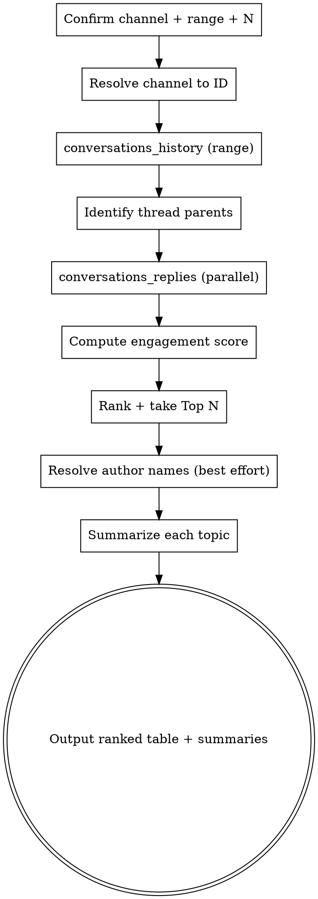

# Slack Hot Topics

## Overview

A repeatable protocol for surfacing and summarizing the **most-engaged discussions** in a Slack channel over a chosen time window. It fetches top-level messages, expands their threads, computes an engagement score, ranks them, and produces a concise Markdown summary directly in chat.

**Core principle:** Rank by real engagement data, never by guessed importance. Every ranked item must trace to actual reply counts and reactions pulled from the Slack MCP server. Never fabricate messages, authors, reactions, or reply counts.

**Requires:** the Slack MCP server (`slack` tools: `conversations_history`, `conversations_replies`, `users_search`, `conversations_search_messages`). If those tools are unavailable, tell the user the Slack MCP server must be configured first and stop.

## When to Use

- User asks for "热门话题 / 热点 / 最多互动" of a Slack channel
- "Top / trending / most active topics or discussions in a channel"
- "Summarize what happened in #channel this week"
- Any request to rank channel messages by engagement over a time range

**Do NOT use when:**
- User asks to read ONE specific message/thread (just fetch it directly)
- User wants to send/post a message (use `conversations_*` send tools directly)
- User wants a full unread inbox across channels (use `conversations_unreads`)

## Required Inputs (ask if missing)

Before running, make sure you have all three. If any is missing, ask the user in ONE `AskUserQuestion` call (batch the questions), then proceed.

| Input | Default | Notes |
|-------|---------|-------|
| **Channel** | — (required) | Prefer a Channel ID like `C374AQJ3W`. `#name` / `@user` also accepted (see Name Resolution below). |
| **Time range** | `7d` | Passed to `conversations_history` `limit`. Accepts `1d`, `7d`, `30d`, `90d`, or a message count like `50`. |
| **Top N** | `10` | How many ranked topics to return. |

Optional refinements the user may specify:
- **Scope filter**: only threads, only messages with reactions, exclude bot/alert messages, only a specific user.
- **Ranking weight override**: see Engagement Score below.

## Channel Input & Name Resolution (SAP Enterprise Grid aware)

SAP Enterprise Grid restricts name-listing APIs (`enterprise_is_restricted`), so `channels_list` / name→ID resolution often fails and returns empty.

**Resolution order:**
1. If input already looks like an ID (`^C[A-Z0-9]{8,}$`) → use it directly.
2. If input is `#name` → try `conversations_search_messages` with `filter_in_channel:"#name"`. If it resolves, capture the channel ID from results.
3. If resolution fails (empty result or `not found` / `enterprise_is_restricted`) → **do not retry blindly**. Tell the user:
   > 该企业 Slack 环境限制了频道名称解析。请提供 Channel ID（形如 `Cxxxxxxxx`），可在 Slack 客户端打开该频道后从 URL 末段获取。
   Then stop and wait for the ID.

Never loop on a restricted API. One attempt, then downgrade to asking for the ID.

## Engagement Score (ranking)

Default weight (chosen default for this skill):

```
score = (reply_count * 2) + (total_reactions * 1)
```

- `reply_count` = number of thread replies (from `conversations_replies`, excluding the parent message itself).
- `total_reactions` = sum of all reaction counts across the parent message AND its replies (parse the `Reactions` column, e.g. `thank-you:1|eyes:1` → 2).

Ranking rules:
- Sort descending by `score`.
- Tie-break by `reply_count`, then by most recent `Time`.
- A brand-new message with 0 replies/0 reactions still appears if it makes the Top N, but flag it as `🆕 just posted / no engagement yet`.

**Weight overrides** (if user asked):
- "纯回复数 / by replies" → `score = reply_count`
- "纯 reactions / by reactions" → `score = total_reactions`
- Custom weights → honor the user's numbers.

Always state which weighting you used in the output header.

## Workflow



## Execution Checklist

Follow in order.

1. **Gather inputs** — channel, range (default `7d`), N (default `10`). Ask via one batched `AskUserQuestion` only if channel is missing.
2. **Resolve channel** — apply the Name Resolution order above. Get a concrete `Cxxxx` ID or stop.
3. **Fetch history** — `conversations_history(channel_id, limit=<range>)`. If empty, note it may be `enterprise_is_restricted` on that channel and ask for a different channel/ID.
4. **Find thread parents** — any row where `ThreadTs` is non-empty and equals its own `MsgID` is a thread root; also treat top-level rows that have replies. Collect their `thread_ts`.
5. **Expand threads in PARALLEL** — issue multiple `conversations_replies(channel_id, thread_ts, limit=<range or 50>)` calls in a single message (one per parent). Do not fetch sequentially unless a value depends on a prior result.
6. **Compute scores** — for each parent: `reply_count` = replies minus parent; `total_reactions` = sum across parent + replies (parse `a:1|b:2`). Apply the score formula.
7. **Rank & slice** — sort desc, tie-break, take Top N.
8. **Resolve author names (best effort)** — the `RealName`/`UserName` columns usually already carry names. If a top item shows only a UserID, optionally `users_search` that ID once. Skip silently if restricted.
9. **Summarize** — for each ranked topic write 1–3 sentences: the ask/issue, who drove it, the outcome/status (✅ resolved / 🟡 in progress / 🔴 open / 🆕 just posted).
10. **Output** — ranked Markdown table + per-topic summaries + a one-line channel characterization. Chat only; do not write files unless the user explicitly asks.

## Output Format (chat only)

```markdown
## <#channel or ID> — Top <N> Hot Topics (last <range>)
_Ranked by: <weighting used> · <M> topics analyzed · <K> threads expanded_

**Channel nature:** <one line inferred from content>

| # | Author | Topic | Replies | Reactions | Score | Status |
|---|--------|-------|--------:|----------:|------:|--------|
| 1 | <name> | <short topic> | <r> | <x> | <s> | ✅/🟡/🔴/🆕 |
| ... |

### Detailed summaries
**1. <Topic title>** — <1–3 sentence summary: the ask, who drove it, the outcome>. <link if permalink available>
**2. ...**
```

Keep topic cells short; put detail in the summaries. Preserve any useful links (docs, tickets, permalinks) found in messages.

## Quick Reference

| Need | Tool / pattern |
|------|----------------|
| Channel history over range | `conversations_history(channel_id, limit="7d")` |
| Thread replies | `conversations_replies(channel_id, thread_ts, limit="7d")` — batch in parallel |
| Resolve ID from `#name` | `conversations_search_messages(filter_in_channel="#name")` (may be restricted) |
| Resolve a UserID → name | `users_search(query="<UserID or iNumber>")` |
| Parse reactions `a:1|b:2` | split on `|`, sum the trailing integers |
| Thread root detection | `ThreadTs != "" && ThreadTs == MsgID`, or top-level with replies |

## Common Mistakes

| Mistake | Fix |
|---------|-----|
| Ranking by "importance" gut-feel | Rank strictly by the engagement score from real data |
| Ignoring thread replies | Most engagement lives in threads — always expand parents |
| Fetching threads one-by-one | Batch `conversations_replies` calls in parallel |
| Retrying a restricted name lookup in a loop | One attempt, then ask user for the Channel ID |
| Counting parent reply as a reply | `reply_count` excludes the parent message |
| Forgetting reactions on replies | Sum reactions across parent AND all replies |
| Dumping full raw messages | Summarize; keep the table tight |
| Writing a file unprompted | Output in chat only unless user asks to save |

## Red Flags — Stop and Reconsider

- You're about to rank a topic higher without a matching reply/reaction count → recompute from data.
- History came back empty and you're about to invent topics → it's likely restricted; ask for another channel/ID.
- You've called the same restricted API 2+ times → stop and switch to asking for the Channel ID.
- Your summary asserts an outcome ("resolved") not present in the thread → downgrade to the actual last-message status.
